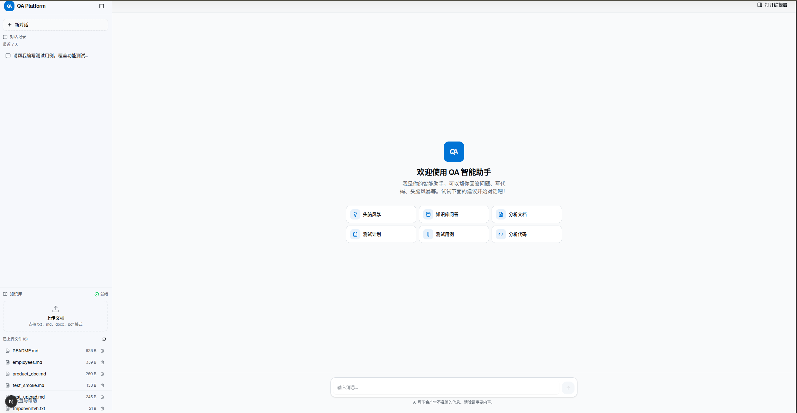

# AI 测试平台 - QA Platform

一个基于大语言模型的智能测试辅助平台，支持测试用例生成、代码分析、需求文档处理等功能。

## 📸 平台预览



## 🏗️ 项目架构

```
qa-platform/
├── agent/              # Python LangChain Agent 服务 (端口 8000)
│   ├── main.py              # FastAPI 应用入口
│   ├── agent_service.py     # LangChain Agent 逻辑
│   ├── intent_detector.py   # 意图检测模块 (Max-Similarity)
│   ├── document_processor.py # 文档智能切分
│   ├── rag_service.py       # RAG 知识库服务
│   ├── tools/               # 工具集
│   │   ├── code_analyzer.py       # 代码分析工具
│   │   ├── test_case_generator.py # 测试用例生成
│   │   └── bug_hunter.py          # 缺陷预测工具
│   ├── config.py            # 配置管理
│   ├── requirements.txt     # Python 依赖
│   └── .env.example         # 环境变量示例
│
├── backend/            # Go 后端服务 (端口 8081)
│   ├── main.go          # Gin 框架应用
│   ├── go.mod           # Go 依赖
│   └── main             # 编译后的二进制
│
├── frontend/           # Next.js 前端 (端口 3000)
│   ├── app/
│   │   ├── api/chat/route.ts   # 聊天 API 路由
│   │   ├── layout.tsx          # 布局组件
│   │   └── page.tsx            # 主页面
│   ├── components/
│   │   ├── ui/                 # shadcn/ui 组件库
│   │   ├── ai-elements/        # AI 聊天组件
│   │   ├── chat-input.tsx      # 聊天输入框
│   │   ├── chat-messages.tsx   # 消息列表
│   │   └── chat-sidebar.tsx    # 会话侧边栏
│   ├── lib/utils.ts            # 工具函数
│   ├── hooks/                  # 自定义 hooks
│   └── package.json            # 依赖配置
│
├── docker-compose.yml   # Docker 编排配置
├── Dockerfile.agent     # Agent 服务镜像
├── Dockerfile.backend   # Backend 服务镜像
├── Dockerfile.frontend  # Frontend 服务镜像
├── .env.example         # Docker 环境变量模板
├── deploy.sh            # 一键部署脚本
├── stop-docker.sh       # 停止服务脚本
├── start.sh             # 开发模式一键启动脚本
└── tests/               # 测试套件
```

## 🔧 核心功能

| 功能模块 | 说明 | 状态 |
|---------|------|------|
| **意图检测** | 基于 Max-Similarity 策略，支持中文模型 (bge-base-zh-v1.5) | ✅ |
| **会话记忆** | 使用 LangChain ConversationBufferMemory | ✅ |
| **文档处理** | 支持语义切分、递归切分、主题识别 | ✅ |
| **代码分析工具** | 分析 Git Commit 变更，生成测试建议 | ✅ |
| **测试用例生成** | 输入需求文本，输出结构化 JSON | ✅ |
| **缺陷预测工具** | 分析历史缺陷，预测高风险模块 | ✅ |
| **多轮对话** | 支持上下文保持，解决"失忆症" | ✅ |
| **RAG 知识库** | 支持 PDF/DOCX/TXT/MD 文档问答 | ✅ |

## 🚀 快速开始

### 方式一：Docker 一键部署（推荐）

```bash
# 1. 进入项目目录
cd qa-platform

# 2. 配置环境变量（可选）
cp .env.example .env
# 编辑 .env 文件，配置 LLM API Key

# 3. 一键部署（自动构建镜像并启动服务）
./deploy.sh
```

**部署脚本特性**：
- ✅ 自动检测 Docker 和 Docker Compose 是否安装
- ✅ 自动检测端口占用（8000/8081/3000）
- ✅ 自动创建 .env 配置文件
- ✅ 自动构建 Docker 镜像
- ✅ 自动启动所有服务并进行健康检查
- ✅ 友好的彩色输出和状态提示

服务地址：
- 前端界面: http://localhost:3000
- Go 后端: http://localhost:8081
- Agent 服务: http://localhost:8000

**停止服务**：
```bash
./stop-docker.sh
```

### 方式二：Docker Compose 手动启动

```bash
# 1. 配置环境变量
cp .env.example .env
# 编辑 .env 文件，填入你的 LLM API Key

# 2. 构建并启动所有服务
docker compose up -d --build

# 3. 查看服务状态
docker compose ps

# 4. 查看日志
docker compose logs -f
```

### 方式三：本地启动（开发模式）

#### 1. 启动 Python Agent 服务

```bash
cd agent

# 激活虚拟环境
source ~/ai_env/bin/activate

# 安装依赖
pip install -r requirements.txt

# 配置环境变量
cp .env.example .env
# 编辑 .env 文件，填入你的 API Key

# 启动服务
python main.py
```

#### 2. 启动 Go 后端服务

```bash
cd backend

# 下载依赖
go mod tidy

# 启动服务
go run main.go
```

#### 3. 启动前端服务

```bash
cd frontend

# 安装依赖
pnpm install

# 启动开发服务器
pnpm run dev
```

### 方式四：开发模式一键启动

```bash
chmod +x start.sh
./start.sh
```

**脚本特性**：
- ✅ 启动前自动检测端口占用（8000/8081/3000）
- ✅ 端口被占用时自动释放
- ✅ 自动安装依赖
- ✅ 后台运行，日志输出到 /tmp

## ⚙️ 配置说明

### Docker 环境变量配置 (`.env`)

```env
# ========================================
# LLM 配置 (至少选择一种)
# ========================================

# 方案1: 使用通义千问 (推荐)
LLM_PROVIDER=qwen
QWEN_API_KEY=your-qwen-api-key-here
QWEN_API_BASE=https://dashscope.aliyuncs.com/compatible-mode/v1
QWEN_MODEL=qwen-plus

# 方案2: 使用 DeepSeek
# LLM_PROVIDER=deepseek
# DEEPSEEK_API_KEY=your-deepseek-api-key-here
# DEEPSEEK_API_BASE=https://api.deepseek.com/v1
# DEEPSEEK_MODEL=deepseek-chat

# 方案3: 使用 OpenAI
# LLM_PROVIDER=openai
# OPENAI_API_KEY=your-openai-api-key-here
# OPENAI_API_BASE=https://api.openai.com/v1
# OPENAI_MODEL=gpt-4o-mini

# 方案4: 使用 Ollama 本地模型
# LLM_PROVIDER=local
# LOCAL_API_BASE=http://localhost:11434/v1
# LOCAL_MODEL=llama3

# ========================================
# 服务配置
# ========================================

# 端口配置（可选，默认值如下）
AGENT_PORT=8000
BACKEND_PORT=8081
FRONTEND_PORT=3000

# JWT 密钥（生产环境请修改）
JWT_SECRET=qa-platform-jwt-secret-change-in-production

# 时区
TZ=Asia/Shanghai
```

### 支持的模型

| 提供商 | 配置方式 | 说明 |
|--------|----------|------|
| 通义千问 | `LLM_PROVIDER=qwen` | 推荐，性价比高 |
| DeepSeek | `LLM_PROVIDER=deepseek` | 开源模型 |
| OpenAI | `LLM_PROVIDER=openai` | GPT-4/GPT-3.5 |
| Ollama | `LLM_PROVIDER=local` | 本地部署模型 |

## 📡 API 接口

### Go 后端接口

| 接口 | 方法 | 说明 |
|------|------|------|
| `/health` | GET | 健康检查 |
| `/api/chat` | POST | 普通对话（同步） |
| `/api/chat/stream` | POST | 流式对话（SSE） |
| `/api/history/{session_id}` | GET | 获取会话历史 |
| `/api/history/{session_id}` | DELETE | 清除会话历史 |
| `/api/export` | POST | 导出对话记录 |
| `/api/auth/login` | POST | 用户登录 |
| `/api/auth/register` | POST | 用户注册 |

**请求示例：**

```bash
curl -X POST http://localhost:8081/api/chat \
  -H "Content-Type: application/json" \
  -d '{"message": "为用户登录功能生成测试用例", "session_id": "test-session"}'
```

### Agent 服务接口

| 接口 | 方法 | 说明 |
|------|------|------|
| `/health` | GET | 健康检查 |
| `/config` | GET | 获取配置信息 |
| `/intent` | POST | 意图检测 |
| `/chat` | POST | 普通对话 |
| `/chat/stream` | POST | 流式对话 |
| `/history/{session_id}` | GET | 获取历史 |
| `/document/process` | POST | 智能文档处理 |
| `/document/upload` | POST | 文档上传 |
| `/rag/query` | POST | RAG 知识库问答 |

### 意图检测接口

```bash
curl -X POST http://localhost:8000/intent \
  -H "Content-Type: application/json" \
  -d '{"message": "帮我写测试用例"}'
```

响应示例：
```json
{
  "intent": "TEST_CASE",
  "description": "测试用例生成",
  "detection_method": "Max-Similarity",
  "confidence": 0.85
}
```

## 🧪 联调验证

1. 打开浏览器访问 http://localhost:3000
2. 在对话框输入测试需求，例如：
   - "为用户登录功能生成测试用例"
   - "分析 commit abc123 的代码变更"
   - "基于刚才的需求，写个自动化脚本"
3. 观察前端是否流畅展示 AI 回复
4. 测试多轮对话上下文保持能力

## 🛠️ 工具集说明

### CodeAnalyzerTool
- **功能**：分析 Git Commit 代码变更
- **输入**：commit_id, repo_path(可选)
- **输出**：代码变更分析报告 + 测试建议

### TestCaseGeneratorTool
- **功能**：生成结构化测试用例
- **输入**：requirement(需求文本), test_type(测试类型)
- **输出**：JSON 格式测试用例

### BugHunterTool
- **功能**：预测高风险模块
- **输入**：defect_logs(缺陷日志), current_changes(本次变更)
- **输出**：风险评估报告

## 🔐 安全说明

- ⚠️ **API Key 仅保存在 Python Agent 服务的配置中**
- ⚠️ **绝对不要将 API Key 暴露给前端或 Go 业务层**
- ⚠️ **`.env` 文件已添加到 `.gitignore`，不会被提交到代码库**
- ⚠️ 支持配置 AUTH_TOKEN 进行 API 访问控制
- ⚠️ 生产环境请修改 JWT_SECRET 为复杂的随机字符串

## 📦 技术栈

| 层级 | 技术 | 说明 |
|------|------|------|
| 前端 | Next.js 16 + shadcn/ui | 现代化全栈框架，支持 SSR |
| 后端 | Go 1.22 + Gin | 高性能 API 网关 |
| Agent | Python 3.11 + FastAPI + LangChain | AI 智能体服务 |
| 嵌入模型 | bge-base-zh-v1.5 | 中文语义理解 |
| 向量存储 | FAISS | 本地向量数据库 |
| 大模型 | 通义千问 / DeepSeek / OpenAI / Ollama | 可切换多种模型 |
| 容器 | Docker + Docker Compose | 一键部署 |

## 📊 意图类型

| 意图 | 说明 | 示例 |
|------|------|------|
| TEST_CASE | 测试用例生成 | "生成登录功能测试用例" |
| TEST_PLAN | 测试计划制定 | "制定测试计划" |
| CODE_ANALYSIS | 代码分析 | "分析代码变更" |
| RAG_QA | 知识库问答 | "查询知识库" |
| RUN_TESTS | 测试执行 | "运行测试" |
| DEFAULT | 默认回答 | 其他输入 |

## 📁 目录结构说明

```
qa-platform/
├── agent/          # AI 智能体服务
│   ├── tools/      # LangChain 工具集
│   └── data/       # 向量数据库和会话数据（运行时创建）
├── backend/        # Go 后端 API
├── frontend/       # Next.js 前端
├── document/       # RAG 文档目录（放置需要问答的文档）
├── embedding_models/ # 嵌入模型存储目录
├── tests/          # 测试套件
└── *.sh            # 部署和启动脚本
```

## 🎯 下一步计划

- [ ] 添加用户认证和权限管理
- [ ] 实现测试用例的持久化存储
- [ ] 添加测试用例模板管理
- [ ] 集成测试执行引擎
- [ ] 添加测试报告生成功能
- [ ] 支持更多 Agent 工具
- [ ] 前端专业化升级（侧边栏、表格渲染、导出功能）

## 📝 License

MIT
